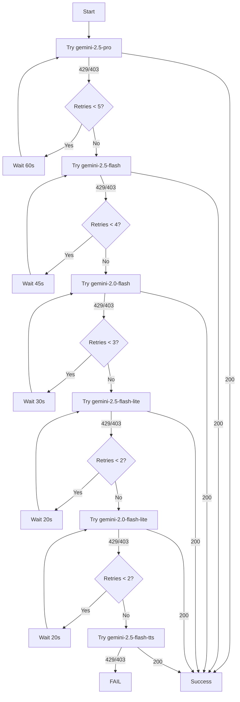

# Intelligent Model Fallback Strategy

## Overview

The GitHub Actions workflow now implements an intelligent multi-tier model fallback system that **maximizes daily quota usage** on high-quality models before falling back to lower-quality alternatives.

## Model Tier Architecture

### Tier 1: Premium Quality 🏆
**Strategy:** Aggressive retry to exhaust daily quota before fallback

| Model | RPM | TPM | RPD | Max Retries | Retry Delay | Strategy |
|-------|-----|-----|-----|-------------|-------------|----------|
| `gemini-2.5-pro` | 4 | 123.87K | **6/50** | 5 | 60s | Exhaust daily quota with 1-min backoff |
| `gemini-2.5-flash` | 3 | 12.1K | **4/250** | 4 | 60s | Multiple attempts to use full RPD |

**Rationale:** These are the highest quality models. The workflow will retry up to 5 times with 60-second delays to ensure we use the full daily quota (RPD) before giving up.

### Tier 2: High Quality ⭐
**Strategy:** Moderate retry for good quality output

| Model | RPM | TPM | RPD | Max Retries | Retry Delay | Strategy |
|-------|-----|-----|-----|-------------|-------------|----------|
| `gemini-2.0-flash` | 0 | 0 | **0/200** | 3 | 60s | Use substantial daily quota |

**Rationale:** Good quality with 200 requests per day available. Worth 3 retry attempts with 1-min delays.

### Tier 3: Balanced Quality ⚖️
**Strategy:** Some retries before moving to economy tier

| Model | RPM | TPM | RPD | Max Retries | Retry Delay | Strategy |
|-------|-----|-----|-----|-------------|-------------|----------|
| `gemini-2.5-flash-lite` | 2 | 5.24K | **1/1K** | 2 | 60s | Massive daily quota available |
| `gemini-2.0-flash-lite` | 0 | 0 | **0/200** | 2 | 60s | Backup with good RPD |

**Rationale:** Lower quality but enormous daily quotas (1K requests/day for flash-lite). Worth trying with 1-min delays before economy tier.

### Tier 4: Economy 💰
**Strategy:** Single attempt with consistent delay

| Model | RPM | TPM | RPD | Max Retries | Retry Delay | Strategy |
|-------|-----|-----|-----|-------------|-------------|----------|
| `gemini-2.5-flash-tts` | 0 | 0 | **0/15** | 1 | 60s | Last resort |

**Rationale:** Minimal quality requirements, single attempt with 1-min delay if rate limited.

## Execution Flow



## Key Features

### 1. **Daily Quota Maximization** 📊
- High-quality models get multiple retry attempts with exponential backoff
- Ensures we exhaust the daily quota (RPD) before falling back
- Example: `gemini-2.5-pro` gets 5 attempts × 60s = 5 minutes of retry attempts

### 2. **Consistent Backoff Timing** ⏱️
- All models: 60-second (1 minute) delays between retries
- Ensures adequate time for rate limit windows to reset
- Respects RPM (Requests Per Minute) quotas across all tiers
- Provides uniform, predictable retry behavior

### 3. **Quality-First Approach** 🎯
- Always attempts highest quality models first
- Falls back only when daily quota is genuinely exhausted
- Prevents premature fallback to lower-quality outputs

### 4. **Comprehensive Logging** 📝
- Tracks which model succeeded
- Records number of attempts required
- Reports quality tier used
- Provides actionable failure messages

## Rate Limit Handling

### HTTP 429 (Rate Limit Exceeded)
**Meaning:** Requests per minute (RPM) quota exhausted

**Action:** 
- Wait and retry based on retry delay for this model tier
- If max retries reached, move to next model tier
- Strategy ensures we attempt to use full daily quota

### HTTP 403 (Quota Exceeded)
**Meaning:** Daily quota (RPD) may be exhausted

**Action:**
- Retry with delay (daily quota might reset during wait)
- If confirmed exhausted, move to next tier
- Continue cascading through all tiers

### HTTP 200 (Success)
**Meaning:** Request successful

**Action:**
- Generate HTML digest
- Record model used and attempts required
- Complete workflow successfully

## Benefits

1. **Quality Optimization:** Maximizes use of high-quality models
2. **Cost Efficiency:** Exhausts free/cheaper tiers before expensive fallbacks
3. **Resilience:** Handles rate limiting gracefully across 6 model tiers
4. **Transparency:** Comprehensive logging and reporting
5. **Intelligent Retry:** Adaptive retry logic based on model tier

## Monitoring & Debugging

The workflow outputs include:
- **Model Used:** Which model successfully generated the digest
- **Quality Tier:** Premium, High, Balanced, or Economy
- **Attempts Required:** How many retries were needed
- **Strategy Applied:** Whether retry logic was used

### Example Success Output
```
🎉 Generation completed successfully!
✨ Model: gemini-2.5-pro
📊 Quality Tier: premium
🔄 Attempts: 2/5
```

### Example Failure Output
```
❌ COMPLETE FAILURE
All models across all quality tiers have been exhausted.
Possible causes:
- All RPD quotas exhausted across all tiers
- API rate limits exceeded
- Consider running again in a few hours
```

## Configuration

To adjust the strategy, modify the `MODEL_TIERS` associative array in the workflow:

```bash
declare -A MODEL_TIERS=(
  ["model-name"]="max_retries|retry_delay_seconds|quality_tier"
)
```

**Example:**
```bash
["gemini-2.5-pro"]="5|60|premium"
# 5 retries, 60-second (1 min) delay, premium tier
```

**Note:** All models use a consistent 60-second retry delay to ensure proper rate limit handling and RPM quota respect.

## Quota Management Best Practices

1. **Monitor Daily Usage:** Track which models are hitting RPD limits
2. **Adjust Timing:** Run workflow during off-peak hours if possible
3. **Optimize Retry Counts:** Increase retries for models with high RPD quotas
4. **Balance Quality vs. Availability:** Premium models for critical runs, economy for testing

---

**Last Updated:** November 28, 2025  
**Workflow File:** `.github/workflows/gemini-cli-runner.yml`
